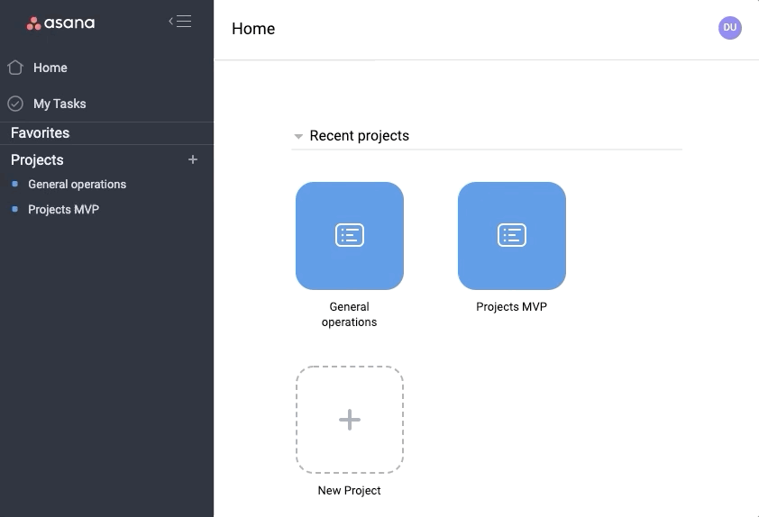

# Notsana

Notsana is a fullstack application clone of Asana, a lightweight productivity tool designed for project/task organization. 
An intuitive interface for adding, organizing, and visualizing work to be done minimizes project management overhead. 
[Check out the app here.](https://notsana.herokuapp.com)

## Features

## Technologies
+ Ruby on Rails
+ React/Redux
+ 

## Future directions
